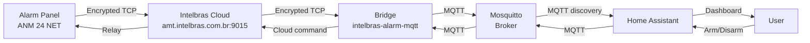

# Intelbras Cloud Relay Bridge for MQTT to Home Assistant

[](https://github.com/robsonmantovani/intelbras-alarm-mqtt/actions/workflows/docker-build.yml)
[](https://ghcr.io/robsonmantovani/intelbras-alarm-mqtt)
[](https://opensource.org/licenses/MIT)

> **Nota**: A imagem Docker é publicada como **privada** por padrão (política do GitHub).
> Para usar, primeiro torne o package público: https://github.com/robsonmantovani/intelbras-alarm-mqtt/pkgs/container/intelbras-alarm-mqtt/settings (botão "Change visibility" → Public).
>
> Se preferir manter privado, faça login antes do pull:
> ```bash
> echo $GITHUB_TOKEN | docker login ghcr.io -u robsonmantovani --password-stdin
> ```


A bridge that connects Intelbras alarm panels (AMT, ANM series) to Home Assistant via MQTT using the Intelbras Cloud Relay.

## Hardware Compatibility

- AMT 2018 / AMT 2018 E Smart
- ANM 24 NET
- Other panels with cloud connectivity

## How it Works

These alarm panels don't accept direct TCP connections from outside. Instead, they communicate through the Intelbras Cloud:



The bridge connects to `amt.intelbras.com.br:9015` (protocol V1) and publishes alarm status to your Home Assistant instance.

## Installation Instructions

### Method 1: Docker Compose (Recommended)

```bash
# 1. Copy and edit your config
cp config.example.yml config.yml
nano config.yml   # fill in MAC, password, MQTT details, zone names

# 2. Pull and start
docker compose pull
docker compose up -d

# 3. Check logs
docker compose logs -f
```

The image is published to GitHub Container Registry:
`ghcr.io/robsonmantovani/intelbras-alarm-mqtt:latest`

### Method 2: Docker (manual)

```bash
docker pull ghcr.io/robsonmantovani/intelbras-alarm-mqtt:latest

docker run -d \
  --name intelbras-alarm-bridge \
  --network host \
  -e CONFIG_PATH=/config/config.yml \
  -e TZ=America/Sao_Paulo \
  -v $(pwd)/config.yml:/config/config.yml:ro \
  --restart unless-stopped \
  ghcr.io/robsonmantovani/intelbras-alarm-mqtt:latest
```

### Method 3: Python (manual install)

```bash
pip install -r requirements.txt
cp config.example.yml config.yml
nano config.yml
python app.py
```

## Setup Examples

### Docker run example with config volume mounted:

```bash
docker run -d \
  --name intelbras-bridge \
  --network host \
  -v /home/intelbras:/etc/intelbras \
  mantovani/intelbras-cloud-relay-bridge \
  --config ./config/config.yml
```

### Manual installation with config:

1. Copy `config.example.yml` to your working directory as `config.yml`
2. Edit your alarm panel configuration (MAC, password, zones)
3. Run `python app_alarm.py`

## Home Assistant Integration

No extra setup needed! The bridge automatically publishes:

- **alarm_control_panel**: Complete alarm entity with arm/disarm capabilities
- **binary_sensor/.{zone_number}**: Individual zone status for all configured zones
- **binary_sensor/siren**: Sirene (sound) state

All entities are auto-discovered by Home Assistant via MQTT discovery payloads.

### Control Topics:

```bash
# Arm the alarm (AWAY mode)
mosquitto_pub -t "intelbras_alarm/alarm/set_state" -m arm

# Disarm
mosquitto_pub -t "intelbras_alarm/alarm/set_state" -m disarm

# Trigger siren
mosquitto_pub -t "intelbras_alarm/siren/control" -m ON
```

## Architecture

### Protocol Flow:

```
Bridge connects to amt.intelbras.com.br:9015 → 
    1. GET_BYTE (0xFB): Fetch encryption key from server
    2. CONNECT V1 (0xE5): Authenticates with MAC + device info
    Status polling (0x5A): Requests 46-byte panel status packet
```

### Home Assistant Entity Examples:

- `alarm_control_panel.intelbras_alarm_central`: Complete alarm control panel
- `binary_sensor.zona_1 through zona_24` (or configured zones)
- `sensor.siren`: Siren/tripple sound state
- `sensor.ac_power`: AC power status detection loss
- `sensor.battery_low`: Low battery warning

## Testing Your Connection

Before deployment use:

```python
import sys
sys.path.insert(0, 'lib')
from isecnet import CloudRelayClient, AlarmStatus

client = CloudRelayClient("MACADDRESS", "password")
print(client.connect())

status = client.get_status() 
print(f"Armed: {status.armed}")
```

## Known Limitations

- Only supports protocol V1 (panels without firmware updates to V2)
- Does not support panels that require authentication via username/password pairs
- Siren activation requires manual intervention if your alarm has specific sirene control commands

---

Created by Robson Mantovani  
License: MIT License
