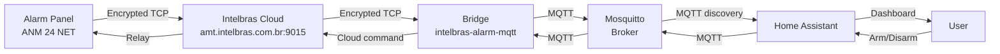

# Intelbras Cloud Relay Bridge for MQTT to Home Assistant

[](https://github.com/robsonmantovani/intelbras-alarm-mqtt/actions/workflows/docker-build.yml)
[](https://ghcr.io/robsonmantovani/intelbras-alarm-mqtt)
[](https://opensource.org/licenses/MIT)

A bridge that connects Intelbras alarm panels (AMT, ANM series) to Home Assistant via MQTT using the Intelbras Cloud Relay.

## Hardware Compatibility

### Tested ✅

- **ANM 24 NET** (firmware 6.6) — confirmed working with 24 zones, arm/disarm, status polling

### Should work (untested, same protocol family)

- AMT 2018 / AMT 2018 E Smart
- Other Intelbras panels that use the same V1 Cloud Relay protocol (`amt.intelbras.com.br:9015`)

PRs welcome if you test on other panels!

## How it Works

These alarm panels don't accept direct TCP connections from outside. Instead, they communicate through the Intelbras Cloud:



The bridge connects to `amt.intelbras.com.br:9015` (protocol V1) and publishes alarm status to your Home Assistant instance.

## Installation Instructions

### Method 1: Docker Compose (Recommended)

```bash
# 1. Copy and edit your config
cp config.example.yml config.yml
nano config.yml   # fill in MAC, password, MQTT details, zone names

# 2. Pull and start
docker compose pull
docker compose up -d

# 3. Check logs
docker compose logs -f
```

The image is published to GitHub Container Registry:
`ghcr.io/robsonmantovani/intelbras-alarm-mqtt:latest`

### Method 2: Docker (manual)

```bash
docker pull ghcr.io/robsonmantovani/intelbras-alarm-mqtt:latest

docker run -d \
  --name intelbras-alarm-bridge \
  --network host \
  -e CONFIG_PATH=/config/config.yml \
  -e TZ=America/Sao_Paulo \
  -v $(pwd)/config.yml:/config/config.yml:ro \
  --restart unless-stopped \
  ghcr.io/robsonmantovani/intelbras-alarm-mqtt:latest
```

### Method 3: Python (manual install)

```bash
pip install -r requirements.txt
cp config.example.yml config.yml
nano config.yml
python app.py
```

## Configuration

All configuration is in `config.yml` (see `config.example.yml`):

```yaml
alarm:
  mac: "REPLACE_WITH_YOUR_PANEL_MAC"
  password: "REPLACE_WITH_YOUR_PASSWORD"
  server: "amt.intelbras.com.br"
  port: 9015
  total_zones: 24
  poll_interval: 5
  command_timeout: 10
mqtt:
  host: "localhost"
  port: 1883
  username: ""
  password: ""
  client_id: "intelbras-alarm-bridge"
  discovery_prefix: "homeassistant"
  topic_prefix: "intelbras_alarm"
zones:
  6:
    name: "Porta da Sala"
    device_class: "door"
  # ... only zones you want exposed to Home Assistant
```

### Log verbosity

Set the `LOG_LEVEL` environment variable to one of:

- `DEBUG` — verbose: every poll, every MQTT message, every status publish
- `INFO` (default) — startup info, connection state, status changes
- `WARNING` — only problems
- `ERROR` — only fatal errors

**Docker Compose:**

```yaml
environment:
  - LOG_LEVEL=DEBUG
```

**Plain Docker:**

```bash
docker run -e LOG_LEVEL=DEBUG ...
```

**Python:**

```bash
LOG_LEVEL=DEBUG python3 app.py
```

**Sample DEBUG output:**

```
2026-06-13 23:45:01 [INFO   ] int-alarm: Intelbras Alarm MQTT Bridge
2026-06-13 23:45:01 [INFO   ] int-alarm.cloud: Connecting to Intelbras cloud relay...
2026-06-13 23:45:02 [INFO   ] int-alarm.cloud: ✅ Cloud relay connected
2026-06-13 23:45:02 [INFO   ] int-alarm.mqtt: ✅ MQTT connected to localhost:1883
2026-06-13 23:45:02 [INFO   ] int-alarm.mqtt: Subscribed to intelbras_alarm/command/#
2026-06-13 23:45:07 [DEBUG  ] int-alarm.cloud: Polling alarm status (zones=24)...
2026-06-13 23:45:08 [INFO   ] int-alarm.mqtt: 📤 Published status to intelbras_alarm/status (arm=disarmed, zones_open=[], siren=False) [412 bytes, mid=42]
2026-06-13 23:45:13 [INFO   ] int-alarm.mqtt: 📩 MQTT message: topic=intelbras_alarm/command/arm payload='arm'
2026-06-13 23:45:13 [INFO   ] int-alarm.cloud: Sending ARM command to alarm...
2026-06-13 23:45:14 [INFO   ] int-alarm.cloud: Arm result: OK
```

### Viewing live logs

```bash
# Docker Compose
docker compose logs -f intelbras-alarm-bridge

# Plain Docker
docker logs -f intelbras-alarm-bridge

# Last 100 lines
docker compose logs --tail=100 intelbras-alarm-bridge
```

## Home Assistant Integration

No extra setup needed! The bridge automatically publishes:

- **alarm_control_panel**: Complete alarm entity with arm/disarm capabilities
- **binary_sensor/.{zone_number}**: Individual zone status for all configured zones
- **binary_sensor/siren**: Sirene (sound) state

All entities are auto-discovered by Home Assistant via MQTT discovery payloads.

### Control Topics:

```bash
# Arm the alarm
mosquitto_pub -t "intelbras_alarm/command/arm" -m ""

# Disarm
mosquitto_pub -t "intelbras_alarm/command/disarm" -m ""

# Siren off (read-only sensor otherwise - see Known Limitations)
mosquitto_pub -t "intelbras_alarm/siren/control" -m "OFF"
```

## Architecture

### Protocol Flow:

```
Bridge connects to amt.intelbras.com.br:9015 → 
    1. GET_BYTE (0xFB): Fetch encryption key from server
    2. CONNECT V1 (0xE5): Authenticates with MAC + device info
    Status polling (0x5A): Requests 46-byte panel status packet
```

### Home Assistant Entity Examples:

- `alarm_control_panel.intelbras_alarm_central`: Complete alarm control panel
- `binary_sensor.zona_1 through zona_24` (or configured zones)
- `sensor.siren`: Siren/tripple sound state
- `sensor.ac_power`: AC power status detection loss
- `sensor.battery_low`: Low battery warning

## Testing Your Connection

Before deployment use:

```python
import sys
sys.path.insert(0, 'lib')
from isecnet import CloudRelayClient, AlarmStatus

client = CloudRelayClient("MACADDRESS", "password")
print(client.connect())

status = client.get_status() 
print(f"Armed: {status.armed}")
```

## Known Limitations

- **Protocol V1 only**: This bridge speaks the V1 Cloud Relay protocol. Panels that have been firmware-updated to V2 (e.g. `amt-mobile-v4.intelbras.com.br`) are not supported.
- **Siren trigger from HA**: There is no known V1 command to *activate* the siren on demand. You can **stop** a sounding siren (command `0x4F`), but to *trigger* it you need to:
  - Arm the alarm and let a zone trigger it (bypass all other zones, leave one open)
  - Or use a physical panic button / the AMT Mobile app
  - The Home Assistant entity exposes the siren as a read-only `binary_sensor` (state of the siren) rather than a controllable `switch`
- **No user/password auth**: V1 Cloud Relay uses MAC + password only. Panels that require a separate user account are not supported.

---

Created by Robson Mantovani  
License: MIT License
